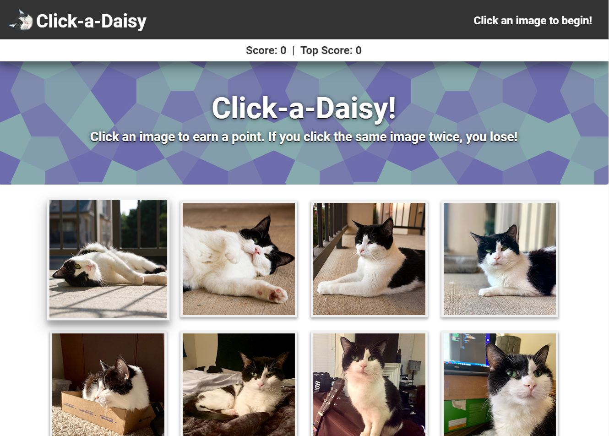

# Click-a-Daisy

Click-a-Daisy is a memory game built with `React.js`. The user must click on the images without clicking on the same image twice until all 16 images are clicked. Each image clicked scores one point but if the same image it clicked twice, the score resets to 0 and the game starts over.

## Technologies used
- React.js (https://reactjs.org/)
- Bootstrap 4(https://getbootstrap.com/docs/4.1/layout/overview/)

This project was bootstrapped with [Create React App](https://github.com/facebook/create-react-app).

## Available Scripts

In the project directory, you can run:

### `npm start`

Runs the app in the development mode. 
Open [http://localhost:3000](http://localhost:3000) to view it in the browser.

The page will reload if you make edits. 
You will also see any lint errors in the console.

### `npm test`

Launches the test runner in the interactive watch mode. 
See the section about [running tests](https://facebook.github.io/create-react-app/docs/running-tests) for more information.

### `npm run build`

Builds the app for production to the `build` folder. 
It correctly bundles React in production mode and optimizes the build for the best performance.

The build is minified and the filenames include the hashes. 
Your app is ready to be deployed!

See the section about [deployment](https://facebook.github.io/create-react-app/docs/deployment) for more information.

